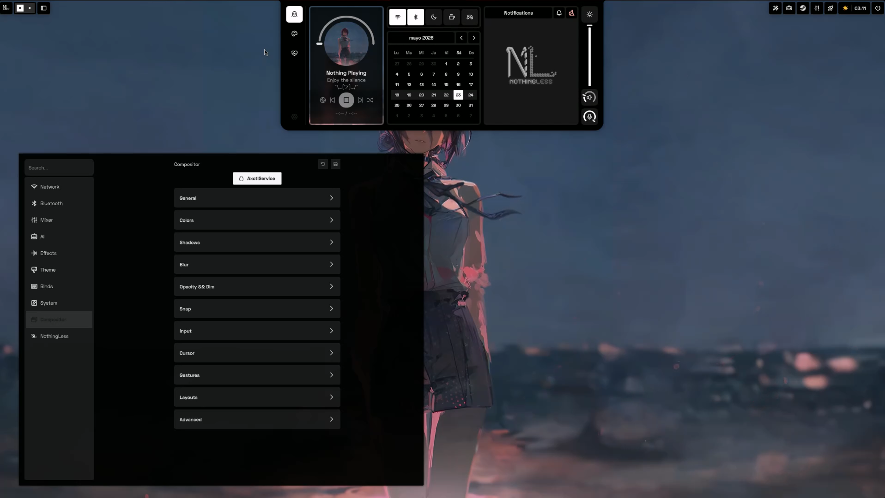
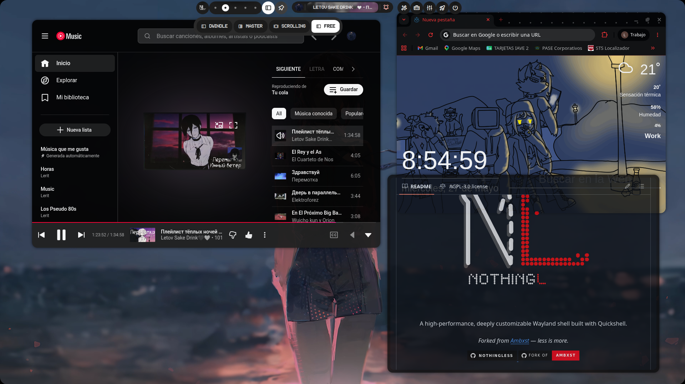
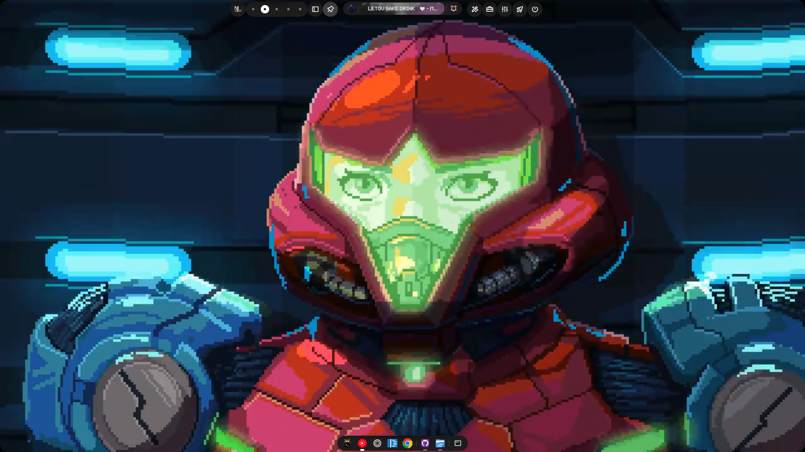
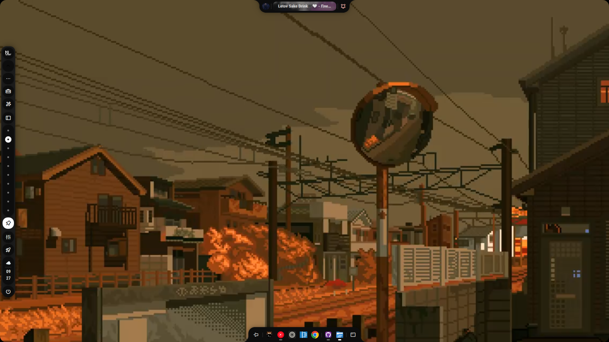
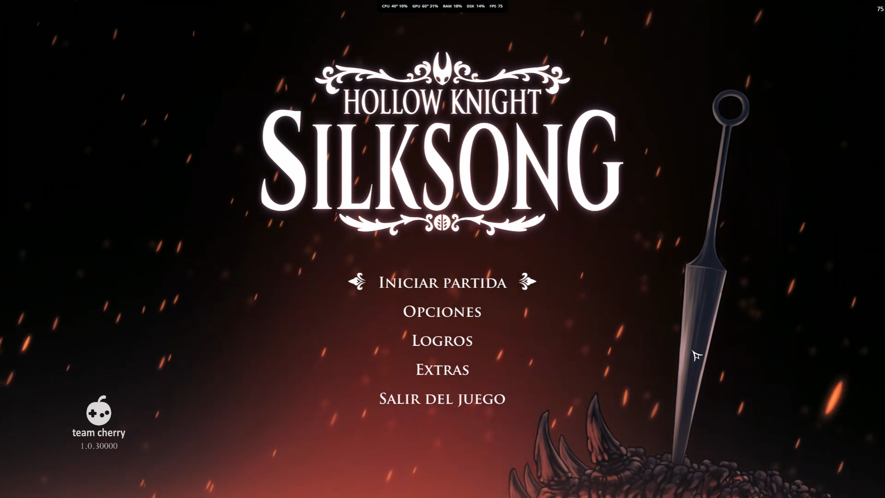

---
<p align="center">
  
  <br><br>
  A high-performance, deeply customizable Wayland shell built with Quickshell.
  <br><br>
  <i>Less is more.</i>
</p>

<p align="center">
  <a href="https://github.com/Leriart/NothingLess">
    
  </a>
  <a href="https://discord.gg/ehQYYW36Up">
    
  </a>
  <a href="https://github.com/leriart/axctl.c">
    
  </a>
  <a href="https://github.com/Axenide/Ambxst">
    
  </a>
</p>

## Screenshots

<p align="center">
  
  &nbsp;&nbsp;
  
  &nbsp;&nbsp;
  
  <br><br>
  
  &nbsp;&nbsp;
  
</p>

---

## Installation

```bash
curl -sL https://github.com/Leriart/NothingLess/raw/main/install.sh | sh
```

Or clone manually:

```bash
git clone https://github.com/Leriart/NothingLess.git ~/.local/src/nothingless
sudo ln -s ~/.local/src/nothingless/cli.sh /usr/local/bin/nothingless
sudo ln -s ~/.local/src/nothingless/scripts/nothing-fps /usr/local/bin/nothing-fps
sudo ln -s ~/.local/src/nothingless/scripts/nothingless-resize /usr/local/bin/nothingless-resize
nothingless
```

### Compositor integration

```bash
nothingless install hyprland           # Auto-detect
nothingless install hyprland --conf    # Force config file mode (default)
nothingless install hyprland --lua     # Force Lua mode (Hyprland >= 0.48)
nothingless remove hyprland            # Remove config
```

On first boot, `exec-once = nothingless` launches the shell, which starts the axctl daemon internally. All compositor settings are managed live via axctl and persisted to `~/.local/share/nothingless/`.

### Wireless screen sharing (Mirai)

NothingLess uses [Mirai](https://github.com/leriart/Mirai) for Miracast screen sharing. The `install.sh` script pulls Mirai automatically. If you installed manually, run the upstream installer once:

```bash
curl -fsSL https://raw.githubusercontent.com/leriart/Mirai/main/install.sh | sh
```

Optional runtime deps by distro:

- **Arch** — `pacman -S miraclecast gnome-network-displays wpa_supplicant avahi gst-plugins-bad`
- **Fedora** — `dnf install miraclecast gnome-network-displays wpa_supplicant avahi gstreamer1-plugins-bad-free`
- **NixOS** — already provided by the NothingLess flake.

Once Mirai is installed, open the **Screen Sharing** panel in the dashboard. The first time you press *Start* it will ask for a password (it runs the daemon as root for Wi-Fi P2P). After that, the panel mirrors Mirai's state and exposes scan / cast / sink-mode controls.

---

## Features

### Desktop & Layout
- **Free Layout** — Windows-like floating desktop with intelligent edge snap and keyboard-driven tiling helpers.
- **Dynamic Island** — unified notch + bar that hosts the launcher, dashboard, notifications, media controls, system metrics and power menu.
- **Dynamic Bar** — static, extended or island modes with per-monitor position, size and widget groups.
- **Integrated Dock** — app dock that can be standalone or merged into the bar.
- **Overview** — Mission Control-style workspace manager with live window previews and drag-and-drop moving.
- **Rounded Corners & Frame Glow** — screen-corner overlay and compositor-synced border accents.
- **Multi-Monitor Variants** — independent shell layers per screen, each with its own bar/notch/dock config.

### Configuration & Personalization
- **Settings Dashboard** — searchable visual config panel with 200+ toggleable options across 11 sections.
- **14 Config Domains** — bar, dock, notch, theme, AI, compositor, binds, monitors, wallpapers, and more, persisted as reactive JSON.
- **12+ Presets** — Dot Matrix, Nothing, Pure Monochrome, Minimal, GNOME, Liquid Glass, and others.
- **Dynamic Theming** — Material You colors extracted from wallpapers via `matugen`; auto-generates GTK, Kitty, Qt6ct, Pywal and Discord configs.
- **Ndot Typography** — dot-matrix typeface and monochrome-with-red-accents design language.
- **Hardware-Accelerated Video Wallpapers** — QtMultimedia + FFmpeg with per-monitor support and audio ducking.
- **M3 Animations** — Material 3, Windows Classic, macOS, Aqua and other animation profiles via `Anim.qml` with global speed scaling.

### Monitors & Display
- **Monitor Configuration GUI** — arrangement canvas, resolution/refresh modes, scale, transform, VRR, HDR, enable/disable and primary selection (nwg-displays-level feature set).
- **Per-Monitor Overrides** — bar/notch/dock position per screen via `monitors.json`.
- **Night Light** — wlsunset integration with smooth temperature transitions.
- **Brightness & DDC** — laptop and external monitor brightness control.

### Wireless & Sharing
- **Screen Sharing via [Mirai](https://github.com/leriart/Mirai)** — the Linux equivalent of Windows `Win + K`. Discover Miracast sinks (TVs, dongles, other PCs) and cast a chosen monitor to them; or turn this machine into a Miracast display that phones, tablets, and other desktops can mirror to. Backed by `miraclecast` (sink mode, requires root) and `gnome-network-displays` (source mode, via the XDG Desktop Portal). All discovery, streaming, and rendering is handled by the Mirai daemon — NothingLess's role is a thin QML control surface and an overlay that shows the current session state.
- **mDNS / Avahi discovery** — Mirai uses Avahi to advertise this machine and find nearby Miracast peers. When `avahi` is running, the panel's sink list is populated automatically after a scan.

### Performance & Power
- **FPS Monitoring** — patched MangoHud + `libambfps.so` writing to shared memory, displayed in the notch metrics overlay.
- **Game Mode** — snapshot/restore compositor settings, pause video wallpaper, suppress notifications, switch animation profile.
- **Focus Mode** — zero gaps + DND + caffeine, snapshot/restore on toggle.
- **Power Profiles** — `power-profiles-daemon` integration with cycle, status in bar and auto-switch to power-saver on low battery.
- **Charge Limit** — battery charge limit via TLP (sudo) or direct sysfs write; auto-detected backend.

### Productivity Tools
- **App Launcher** — fuzzy application search with multi-tab categories.
- **Persistent Clipboard** — searchable history with categories, favorites, QR/URL previews.
- **Notes Editor** — rich text notes with file tree and search.
- **Todo Board** — priority, due dates and reminders.
- **Tmux Manager** — session and window control.
- **Calculator, Translator & OCR** — quick math, translation and screen text extraction.
- **Screenshots & Screen Recording** — region/window/screen capture and recording via `grim`/`slurp` and `gpu-screen-recorder`/`wf-recorder`.

### Media, Network & AI
- **AI Assistant Sidebar** — multi-provider chat (OpenAI, Gemini, Anthropic, Mistral, Groq, Ollama, DeepSeek, MiniMax) with tool calling, MCP/agent support and streaming.
- **MPRIS Controller** — media controls for players in bar, notch and dashboard.
- **Weather Service** — location-based forecast with day/night detection.
- **Network & Bluetooth** — Wi-Fi scan/connect, Bluetooth pairing and audio device mixer.
- **Notifications** — D-Bus notification server with persistence, history and DND mode.

### Compositor Integration (Hyprland)
- **Axctl Bridge** — dedicated Go daemon for Hyprland IPC; handles window focus, workspace dispatch, monitor events and config persistence.
- **130+ Compositor Settings** — live-applied gaps, decoration, blur, shadows, animations and keybinds from the NothingLess GUI.
- **Snapshot/Restore** — instant rollback for game/focus mode and config experiments.
- **Lockscreen** — secure `WlSessionLock` + PAM authentication.

### Under the Hood
- **62 reactive singleton services** for system state, compositor IPC, media, AI and hardware.
- **41 backend scripts** in Python and Bash for monitoring, image processing, clipboard and external tool wrappers.
- **Nix flake** with package, dev shell and NixOS module.
- **Distribution-aware installer** for Arch, Fedora and NixOS.

---

## FPS Monitoring

NothingLess includes two FPS backends that write to `/dev/shm/nothingless_fps`, displayed in real time in the notch metrics overlay.

### nothing-fps (recommended)

Uses a patched MangoHud + `libambfps.so` fallback. Works with Vulkan and OpenGL games.

```bash
# Terminal
nothing-fps ./my-game
nothing-fps --visible vkcube          # show FPS overlay too

# Steam — launch options for any game
nothing-fps %command%

# Lutris / Heroic / Bottles
nothing-fps <game command>
```

Enable the notch metrics display:
```bash
nothingless run toggle-metrics
```

Or set `showMetrics: true` in `~/.config/nothingless/config/notch.json`.

**How it works:**
```
nothing-fps %command%
  → LD_PRELOAD=libMangoHud_shim.so:libambfps.so
  → MANGOHUD_CONFIG=fps_only,background_alpha=0,...  (invisible overlay, shm output)
  → game runs → FPS written to /dev/shm/nothingless_fps
  → SystemResources.fpsWatcher reads via tail -F
  → Notch displays real-time FPS
```

### ambfps-launcher (lightweight alternative)

Uses only `libambfps.so` (no MangoHud dependency). Lighter weight but Vulkan-only.

```bash
ambfps-launcher ./my-game
ambfps-launcher %command%             # Steam
```

---

## Commands

```bash
nothingless                            # Start the shell
nothingless reload                     # Reload the shell
nothingless quit                       # Quit the shell
nothingless lock                       # Activate lockscreen
nothingless update                     # Update NothingLess
nothingless run <module>               # Run a module (launcher, dashboard, overview, etc.)
nothingless run toggle-metrics         # Toggle FPS/CPU/GPU metrics in notch
nothingless run gamemode               # Toggle game mode
nothingless run focusmode              # Toggle focus mode
nothingless run caffeine               # Toggle caffeine (idle inhibit)
nothingless run dnd                    # Toggle do-not-disturb
nothingless profile <saver|balanced|performance>  # Set power profile
nothingless cycle-profile              # Cycle to next power profile
nothingless charge-limit [on|off|50-100]           # Battery charge limit
nothingless brightness <0-100>         # Set brightness
nothingless screen on|off              # Display power control
nothingless suspend                    # Suspend system
nothingless install hyprland [--lua]   # Install compositor integration
nothingless remove hyprland            # Remove compositor integration
```

**Standalone companion commands:**
```bash
nothing-fps [--visible] <command>      # Launch game with FPS monitoring
nothing-fps --help                     # Show FPS launcher help
nothingless-resize                     # Window resizing tool
```

---

## Default Keybinds

Synced from `~/.config/nothingless/binds.json` to Hyprland by `sync-hyprland.py` and `axctl`. Modify any of them in the NothingLess **Binds** settings panel or by editing `binds.json` directly.

### Shell Modules

| Keybind | Action |
|---------|--------|
| `SUPER` | Open launcher (release) |
| `SUPER + D` | Toggle dashboard |
| `SUPER + A` | Toggle AI assistant |
| `SUPER + V` | Toggle clipboard |
| `SUPER + .` | Emoji picker |
| `SUPER + N` | Toggle notes |
| `SUPER + T` | Tmux manager |
| `SUPER + ,` | Wallpaper picker |

### System

| Keybind | Action |
|---------|--------|
| `SUPER + L` | Lock screen |
| `SUPER + S` | Tools menu |
| `SUPER + TAB` | Overview (Mission Control) |
| `SUPER + ESC` | Power menu |
| `SUPER + SHIFT + C` | Open NothingLess settings |
| `SUPER + SHIFT + A` | Color picker / lens |
| `SUPER + SHIFT + S` | Screenshot |
| `SUPER + SHIFT + R` | Screen record |
| `SUPER + ALT + B` | Reload shell |
| `SUPER + CTRL + ALT + B` | Quit shell |
| `SUPER + SHIFT + M` | Toggle notch metrics (FPS/CPU/GPU) |
| `SUPER + SHIFT + BACKSPACE` | Toggle game mode |
| `SUPER + SHIFT + F` | Toggle focus mode |
| `SUPER + SHIFT + N` | Toggle do-not-disturb |
| `SUPER + PAUSE` | Toggle caffeine (idle inhibit) |
| `SUPER + SHIFT + B` | Cycle power profile |

---

## Testing

```bash
# Test FPS pipeline (3 terminals)
# Terminal 1 — watch shared memory
watch -n0.5 cat /dev/shm/nothingless_fps

# Terminal 2 — launch vkcube with FPS monitoring
nothing-fps vkcube

# Terminal 3 — verify libraries loaded
cat /proc/$(pidof vkcube)/maps | grep -E "libMangoHud|libambfps"
```

Expected output in Terminal 1:
```
fps=1440.5
pid=12345
frames=1234
source=mangohud
```

If you see `source=nothingless-preload`, the `libambfps.so` fallback is active (Vulkan hooks). If you see nothing, ensure:
- Libraries exist at `~/.local/lib/libMangoHud_shim.so` and `~/.local/lib/libambfps.so`
- Notch metrics are enabled (`nothingless run toggle-metrics`)
- Rebuild patched MangoHud: `./scripts/mangohud-patch/build-mangohud.sh`

---

## Credits

- **Leriart** — NothingLess developer and maintainer
- **Zack** ([@zackytodearena](https://bsky.app/profile/zackytodearena.bsky.social)) — logo & animation design
- **outfoxxed** — creator of [Quickshell](https://git.outfoxxed.me/outfoxxed/quickshell)
- **Axenide** — original [Ambxst](https://github.com/Axenide/Ambxst) creator, whose work this project was forked from

---

## License

- NothingLess modifications are provided under the same license as the upstream.
- Ambxst and the Ambxst logo are trademarks of Adriano Tisera (Axenide).
- See [LICENSE](./LICENSE) and [TRADEMARK.md](./assets/nothingless/TRADEMARK.md) for details.
